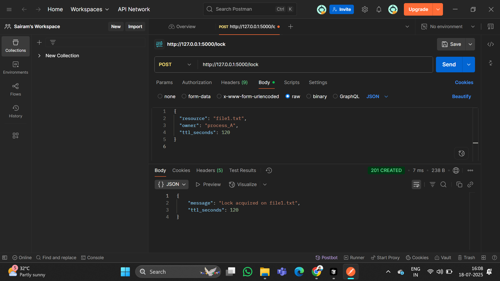

# 🔐 Lock Manager API

A simple Flask-based REST API to manage resource locks with expiration and filtering.

## Features
- Acquire lock with optional TTL (default 5 mins)
- View all active locks (`GET /locks`)
- Filter locks by process ID (`GET /lock/process/<process_id>`)
- Locks automatically expire based on TTL

## 📸 Sample API Response (Postman)

This is a successful response when locking a resource:



## How to Run

```bash
pip install -r requirements.txt
python app.py
